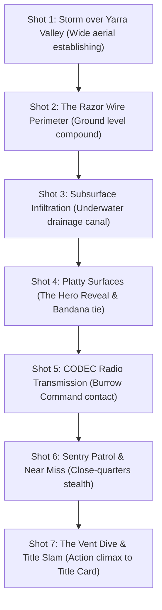

# Plattypus: Tactical Espionage Action — Intro Animation Vision & Prompt Guide

This document provides the complete cinematic vision, aesthetic direction, storyboards, and AI video generation prompts for the **Opening Intro Cinematic** of *Plattypus: Tactical Espionage Action*. 

You can use this guide directly to prompt Google Gemini / video generation models (Veo, Imagen Video, Runway, Sora) to produce the official intro cinematic.

---

## 1. Cinematic Vision & Aesthetic Bible

* **Core Concept**: A high-stakes 90s tactical military espionage thriller (*Metal Gear Solid* 1998 tone) played completely straight, where the elite covert operative is an adorable, serious Australian platypus in an olive-drab combat headband.
* **Visual Style**:
  * **Aspect Ratio**: Cinematic 16:9 widescreen with 2.35:1 letterbox bars.
  * **Lighting**: Cold, moody noir. Torrential rain at midnight, volumetric halogen searchlight beams slicing through mist, deep blue-grey shadows, glistening wet concrete, industrial puddle reflections.
  * **Atmosphere**: Authentic 1998 PlayStation CGI / pre-rendered intro cinematic fidelity with modern atmospheric lighting, CRT phosphor glow, subtle film grain, and moisture droplets on the camera lens.
* **Audio Direction**:
  * Ominous low synthesizer drones building into driving military electronic percussion (synthesized heartbeat rhythm).
  * Distant thunder, relentless torrential rainfall drumming against metal corrugated roofing, guard boots marching on wet steel grating.
  * Iconic radio static and the high-pitched double chirp of an incoming CODEC call (*BEEP-BEEP*).

---

## 2. Character & Environment Designs

### Platty (Operative 01)
* **Species**: Semi-aquatic Australian Duck-billed Platypus (*Ornithorhynchus anatinus*).
* **Appearance**: Sleek, dark brown waterproof fur glistening with rain droplets; wide, flexible rubbery duck-bill with sensitive electro-receptor pits; broad paddle-shaped beaver tail; webbed front paws with retractable digging claws; venomous spurs visible on rear ankles.
* **Gear**: Weathered olive-drab combat headband (bandana) knotted behind his head, tails fluttering in the wind; miniature tactical radio earpiece fitted into his fur; lightweight waterproof webbing harness with a yabby ration pouch.
* **Demeanor**: Stoic, hyper-focused, tactical, disciplined ninja-like movement.

### Sanctuary Security Guards & Drones
* **Guards**: Heavily outfitted nocturnal security guards in long dark-navy waterproof trench coats, heavy tactical combat boots, helmets with amber night-vision visors, carrying stun-batons and flashlights.
* **Drones**: Hovering quad-rotor surveillance drones with green and red searchlight spotlights scanning the grounds.

### Healesville Wildlife Compound (The Infiltration Zone)
* Brutalist concrete security walls crowned with coiled razor wire.
* Heavy iron drainage sluice gates, rusted industrial vents, stormwater culverts with rushing dark water.
* Weathered warning signs stenciled in industrial yellow: *"HEALESVILLE SPECIAL RESEARCH FACILITY — LEVEL 4 QUARANTINE — AUTHORIZED PERSONNEL ONLY"*.

---

## 3. Shot-by-Shot Storyboard



### Shot 1: Storm Over the Valley (0:00 – 0:06)
* **Camera**: Sweeping high aerial drone shot descending through ominous storm clouds over the dark, eucalyptus-covered mountains of Victoria's Yarra Valley at midnight. Lightning illuminates a sprawling, high-security industrial wildlife facility nestled in the forest.
* **Visuals**: Rain lashing across the camera lens. Flashes of lightning reveal razor-wire perimeter walls and sweeping searchlights crisscrossing the compound.
* **Audio**: Heavy rolling thunder, howling wind, low ambient synth pads.

### Shot 2: The Perimeter Sentry (0:06 – 0:12)
* **Camera**: Low-angle tracking shot along a rain-slicked concrete catwalk.
* **Visuals**: A security guard in a heavy trench coat marches past. His spotlight sweeps downward across a flooded storm canal. Water gushes from giant drainage pipes below.
* **Audio**: Heavy boot steps clanging on steel grating, rain splashing, guard radio squawk: *"Sector 4 clear. Drainage sluice 09 sealed."*

### Shot 3: Subsurface Breach (0:12 – 0:18)
* **Camera**: Underwater shot inside the murky green-tinted storm canal. Bubbles rise past the lens.
* **Visuals**: Sleek silhouette swimming with powerful alternating thrusts of webbed feet. Two claws pry open a rusted iron grate with practiced tactical efficiency.
* **Audio**: Muffled underwater acoustics, rushing water currents, metallic groaning of bending iron.

### Shot 4: The Operative Surfaces (Hero Reveal) (0:18 – 0:26)
* **Camera**: Extreme close-up breaking through the water surface. Slow-motion water sheets roll off sleek brown fur and a dark rubbery bill.
* **Visuals**: Platty pulls himself onto the edge of a wet concrete dock in the shadows beneath a cargo loading bay. Water beads fly off his tail. He reaches up with both webbed paws and tightens the knot of his olive-drab combat headband. His dark eyes glint with steely resolve as the headband tails flap in the driving rain.
* **Audio**: Water splashing, crisp fabric tightening sound, military synth beat kicks in.

### Shot 5: CODEC Transmission — Burrow Command (0:26 – 0:38)
* **Camera**: The frame shrinks slightly as an authentic Metal Gear Solid-style green tactical digital CODEC interface slides onto the screen. Frequency display dials to **140.85**.
* **Visuals**: 
  * Left portrait: Platty, crouching in shadow, listening through his earpiece.
  * Right portrait: **Burrow Command** — Dad (senior platypus with silver whiskers wearing a tiny communication headset) sitting in a cozy burrow lined with glowing CRT screens and river roots.
* **Dialogue**:
  * **Dad (Radio)**: *"Platty, come in! You've breached the Healesville perimeter. Security is on high alert."*
  * **Platty (Whisper)**: *"I'm in the drainage docks. What's the situation at the burrow?"*
  * **Mom (Chiming in on radio)**: *"Platty darling! Baby sister Pip's hatching ceremony is at dawn on the beach. She's counting on you to bring her a golden star yabby! Don't be late, and wear your warm coat!"*
  * **Dad**: *"Focus, son. Head through the air ducts into the main compound. Stay out of the searchlights. We cannot afford an alert. Burrow Command out."*
* **Audio**: Digital transmission burst, electronic frequency tuning, synthesized radio voice filter.

### Shot 6: Sentry Patrol & Near Miss (0:38 – 0:48)
* **Camera**: Dutch-angle medium shot behind a row of wooden shipping crates stenciled *"MELBOURNE ZOOLOGICAL CARGO"*.
* **Visuals**: A sentry with a powerful flashlight walks directly toward Platty's position. The cone of bright yellow light creeps across the concrete, illuminating puddles inches from Platty's crouching paws. Platty presses flat against the wet wooden crate, his beaver tail tucked tightly in, blending completely with the dark mahogany wood.
* **Audio**: Sentry's heavy breathing, flashlight beam hum, Platty's tense, silent breathing.

### Shot 7: The Vent Dive & Title Card Slam (0:48 – 0:56)
* **Camera**: Dynamic high-speed camera tracking behind Platty.
* **Visuals**: The moment the sentry turns his back, Platty sprints forward on all fours, executes a flawless forward dive through an open air ventilation duct, and slides into the dark metal tunnel. 
* **The Sentry**: The guard whips around with a classic **red exclamation mark `!`** flashing above his helmet with an audible sting: *"Huh?! Just a rat..."*
* **Title Card Slam**: The camera rushes down the pitch-black ventilation shaft toward a glowing green grate at the end. Sudden cut to black!
* **Typography**: Heavy embossed golden military stencil typography slams onto the screen with a massive metallic impact:
  ```
  PLATTYPUS : TACTICAL ESPIONAGE ACTION
                     PROJECT PSOXIDE
  ```
* **Audio**: Iconic PS1 metallic crash sound, thunderous drum hit, triumphant brass espionage overture swelling into the main game theme.

---

## 4. Master Prompt for Gemini / AI Video Generation

Copy and paste this consolidated prompt into Gemini / Google Veo / video generation models:

```text
Cinematic 1998 video game opening cutscene in 4K resolution, 16:9 widescreen with letterbox cinematic black bars. 
Nighttime torrential rainstorm over a brutalist concrete high-security military wildlife research compound nestled in the dark misty gum-tree mountains of Australia. Volumetric halogen searchlights scan the rain-slicked tarmac and barbed wire fences.
A tactical Australian duck-billed platypus operative wearing an olive-drab combat headband (bandana) knotted behind his head surfaces silently from a flooded drainage canal, water rolling off his sleek dark brown waterproof fur and rubbery duck bill. He pulls himself onto a wet dock in the shadows behind cargo crates, his webbed claws gripping the concrete and his broad beaver tail steadying him.
He taps a miniature tactical radio earpiece. A high-tech green night-vision heads-up display and digital radio interface appears. 
A heavily outfitted security guard with a flashlight walks past; the platypus stealthily presses flat against a wooden shipping crate, blending seamlessly into the shadows. The moment the guard turns, the platypus executes a swift ninja-like forward dive into a low air ventilation shaft. 
The guard turns around with a bright red exclamation mark flashing above his helmet. 
Dramatic cinematic lighting, atmospheric rain droplets on the lens, moody noir aesthetic, cinematic 90s action thriller style, photorealistic wet fur textures and metallic reflections.
```
