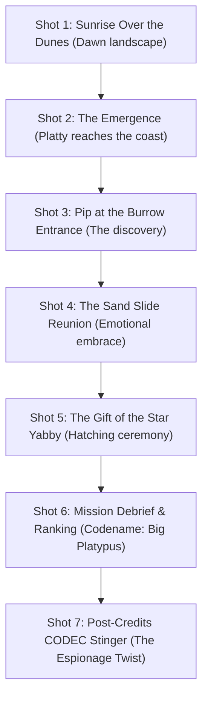

# Plattypus: Tactical Espionage Action — Outro Animation Vision & Prompt Guide

This document provides the complete cinematic vision, aesthetic direction, storyboards, and AI video generation prompts for the **Ending Outro Cinematic** of *Plattypus: Tactical Espionage Action*.

You can use this guide directly to prompt Google Gemini / video generation models (Veo, Imagen Video, Runway, Sora) to produce the official ending sequence and post-credits stinger.

---

## 1. Cinematic Vision & Aesthetic Bible

* **Core Concept**: The emotional and visual catharsis following an intense nocturnal infiltration. The harsh, rain-soaked industrial darkness of the military compound gives way to a breathtaking Australian coastal sunrise, transitioning into a heartwarming family reunion and a classic espionage post-credits twist.
* **Visual Style**:
  * **Aspect Ratio**: 16:9 widescreen with 2.35:1 letterbox bars.
  * **Lighting**: Radiant golden hour. Warm amber sunlight shimmering across rolling ocean surf, golden sand dunes, and sea mist. Long cinematic shadows cast by coastal tea-trees and weathered driftwood.
  * **Atmosphere**: Pure nostalgic relief and beauty. Warm pastel tones (golden amber, sky azure, soft turquoise sea foam), gentle lens flares, and salt breeze blowing through coastal tussock grass.
* **Audio Direction**:
  * Sweeping orchestral acoustic theme: fingerpicked 12-string acoustic guitar, warm cello, and soaring woodwinds blending Australian folk melody with heroic espionage strings.
  * Gentle, rhythmic ocean waves lapping against the shore, morning Australian birdsong (magpies and fairy-wrens warbling in the dunes).
  * Post-credits transition: sudden return to high-tension radio static and digital CODEC chimes.

---

## 2. Character & Environment Designs

### Platty (The Victorious Brother)
* **Appearance**: Exhausted, muddy, salt-crusted, but beaming with triumphant pride. His green combat headband is untied and draped loosely around his neck like a medal of honor.
* **Item**: Clutched securely in his webbed front paws is the **Golden Star Yabby** — a luminous, pristine freshwater crustacean glowing with a warm, iridescent golden bioluminescence.

### Baby Sister Pip (The Newborn Puggle)
* **Appearance**: An adorably round, fluffy baby platypus (a "puggle"). Soft velvety light-grey fur, oversized round dark button eyes filled with innocence and wonder, a tiny soft pink-grey rubbery bill, and small paddle paws.
* **Personality**: Joyful, energetic, loving, and in awe of her big brother.

### Mom & Dad (Burrow Command)
* **Dad**: Senior platypus with wise silver-tipped facial fur, wearing his radio earpiece around his neck, looking on with paternal pride.
* **Mom**: Warm, expressive platypus mother wrapped in a woven eucalyptus fiber scarf, holding a welcoming plate of river marsh-grass cakes.

### The Coastal Sanctuary Burrow (The Destination)
* A hidden ancestral home burrow sheltered beneath the intertwined roots of an ancient coastal banksia tree embedded in the dunes overlooking Port Phillip Bay.
* The interior glows warmly with morning light, dried sea-grass bedding, and seashells.

---

## 3. Shot-by-Shot Storyboard



### Shot 1: Dawn Over the Dunes (0:00 – 0:08)
* **Camera**: Sweeping high-angle crane shot looking out over the Victorian coastline at daybreak. The sun rises over the horizon, painting the sky in vibrant shades of peach, gold, and soft violet.
* **Visuals**: Turquoise ocean waves roll gently onto the clean white sands. Coastal tea-trees and spinifex grass sway in the morning breeze. In the distance, the silhouette of Melbourne's skyline fades into the morning haze across the bay.
* **Audio**: Swelling orchestral strings and warm acoustic guitar melody, gentle surf crashing, distant sea gulls and morning magpie calls.

### Shot 2: The Operative Emerges (0:08 – 0:16)
* **Camera**: Low-angle ground tracking shot tracking Platty's footsteps in the pristine sand.
* **Visuals**: Platty crests the ridge of a towering golden sand dune. He stops and catches his breath. His fur is damp and scuffed with city grit, river moss, and sand. He unknots his olive-drab combat headband, letting the cool morning ocean breeze ruffle his fur.
* **Audio**: Platty's soft, relieved exhale; the rustle of coastal grass.

### Shot 3: The Discovery (0:16 – 0:24)
* **Camera**: Medium close-up of a cozy hollow beneath an ancient weathered driftwood root nestled in the dunes.
* **Visuals**: A tiny snout pokes out from the dark burrow entrance, sniffing the salty morning air. Two enormous, shiny black eyes peek over a gum-leaf doorstep. It's **baby sister Pip**! She spots Platty standing on the crest of the dune and lets out an ecstatic, high-pitched puggle chirp!
* **Audio**: Pip's delighted squeaks, lively playful woodwind trills in the musical score.

### Shot 4: The Sand-Slide Reunion (0:24 – 0:34)
* **Camera**: Fast tracking shot alongside Platty as he drops onto his belly.
* **Visuals**: Platty toboggans down the slope of the dune on his stomach, steering playfully with his broad beaver tail like a surfboard, spraying golden sand on both sides. Pip scrambles out of the burrow with her tiny flippers flapping clumsily. 
* **The Embrace**: Platty slides to a gentle stop right in front of Pip. Pip throws her tiny webbed arms around his neck, burying her face into his fur. Platty wraps his beaver tail protectively around her, laughing with pure joy. Mom and Dad emerge from the burrow, wiping away tears of joy and embracing them both.
* **Audio**: Warm emotional strings swell into the main theme's heartfelt chorus. Laughter and loving purring sounds.

### Shot 5: The Gift of the Star Yabby (0:34 – 0:44)
* **Camera**: Intimate over-the-shoulder close-up.
* **Visuals**: Platty gently reaches into his tactical ration pouch and withdraws the **Golden Star Yabby**. Its translucent amber shell glows with a soft, pulsing golden light. He kneels and presents it to Pip. 
* **Pip's Reaction**: Pip's eyes widen with pure enchantment. She gingerly takes the glowing crustacean with both tiny paws, hugging it against her chest like the greatest treasure in the world. The warm golden light illuminates her beaming face.
* **Camera Crane**: The camera cranes upward into the blue morning sky, framing the four platypuses gathered outside their seaside burrow as the sun fully clears the horizon.
* **Audio**: Soaring French horn and orchestral finale reaching a grand, uplifting resolution. Fade to black.

### Shot 6: Mission Debrief & Codename Screen (0:44 – 0:54)
* **Visuals**: Minimalist MGS-style tactical debrief interface with green CRT monitor scanlines:
  ```
  ==============================================
  MISSION ACCOMPLISHED : OPERATION PIP'S DAWN
  ==============================================
  INFILTRATION TIME      :  00:48:22
  ENEMIES NEUTRALIZED    :  14 (NON-LETHAL)
  ALERTS TRIGGERED       :  0 (GHOST STATUS)
  STAR YABBIES RECOVERED :  50 / 50
  O2 EFFICIENCY          :  98.4%
  ----------------------------------------------
  TACTICAL EVALUATION    :  EXEMPLARY
  SPECIAL CODENAME       :  BIG PLATYPUS
  ==============================================
  ```
* **Audio**: Tactical mission debrief synthesizer chords, retro keyboard typing chimes.

### Shot 7: Post-Credits CODEC Stinger (The Sequel Tease) (0:54 – 1:06)
* **Visuals**: Complete pitch black. A sudden flash of green digital frequency meters. 
* **Iconic Audio**: *BEEP-BEEP! BEEP-BEEP!* The CODEC connects to an encrypted frequency: **140.96**.
* **Voice 1 (Secret Operative, whispering over heavy radio static)**:
  *"Director... Operative Platty has reached the coast. The Sanctuary's security protocols failed completely. The Yarra runner flumes, the downtown grid... he breached them all without firing a shot."*
* **Voice 2 (Deep, gravelly, menacing amphibian croak with an Australian drawl)**:
  *(Sound of a match striking and lighting a cigar)*
  *"Good. He was the only test subject capable of surviving the field run. He has proven our mechanical sentries are obsolete..."*
* **Voice 1**:
  *"What are your orders, Dr. Cane?"*
* **Voice 2**:
  *"Initiate Phase 2... Prepare Project Echidna. It's time to bring the war to the bay."*
* **Iconic Audio**: Dramatic tactical bass sting! Transmission cuts to static.
* **Text on Screen**:
  ```
  PLATTYPUS WILL RETURN.
  ```

---

## 4. Master Prompt for Gemini / AI Video Generation

Copy and paste this consolidated prompt into Gemini / Google Veo / video generation models:

```text
Cinematic 1998 video game ending cutscene in 4K resolution, 16:9 widescreen with letterbox cinematic black bars. 
Early morning golden hour sunrise over coastal Australian sand dunes and rolling turquoise ocean waves at Port Phillip Bay. Gentle sea breeze blowing through wild coastal grass and tea trees.
An Australian duck-billed platypus hero with sleek waterproof brown fur stands atop a golden sand dune, exhausted and scuffed from battle, with his olive-drab combat headband draped loosely around his neck. 
He slides down the sand dune on his belly into a joyful emotional embrace with his adorable baby sister Pip, an impossibly cute baby platypus puggle with giant round dark button eyes and a tiny soft bill. The platypus mother and father emerge from an ancestral burrow under a giant weathered driftwood tree, tearfully embracing them both with their broad beaver tails.
The hero reaches into his pouch and presents his baby sister with a glowing Golden Star Yabby crustacean that emits a warm, magical amber bioluminescence. The baby puggle hugs the glowing yabby with pure wonder.
Warm cinematic golden lighting, photorealistic fur textures, soft lens flares, heartwarming and cinematic emotional tone, 90s prestige cinematic animation aesthetic.
```
