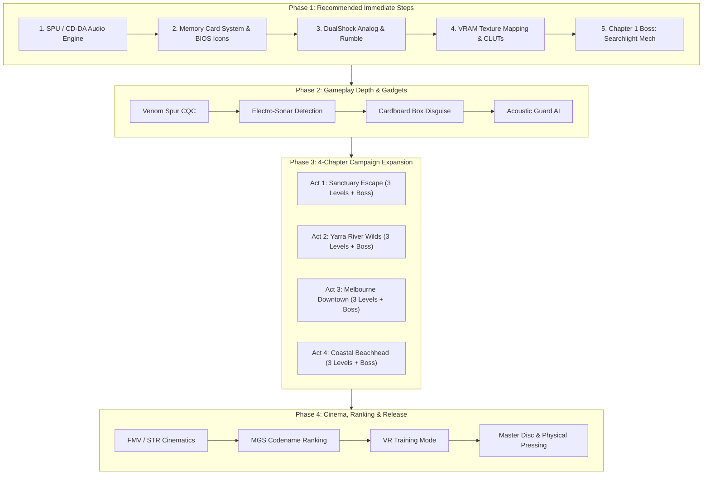

# Plattypus: Tactical Espionage Action — PSX Completion Plan (Superseded)

> **Status: largely superseded — kept for historical reference.**
> Phases 1-6 below are implemented. The campaign shipped as 12 acts across
> 4 chapters plus 4 VR missions, not the "4-stage prototype" the Executive
> Summary describes, and the codename list and VR count below are out of date
> (the game ships 12 codenames and 4 VR missions). For current engineering
> status see [REVIEW.md](REVIEW.md) and the git history. Section headings are
> preserved as written so the original plan can still be read.

## Executive Summary & Vision

**Plattypus: Tactical Espionage Action** is a 3D tactical stealth action game developed for the original PlayStation (PS1 / PSX) hardware using Rust and the `psoxide` SDK. 

The goal of this plan was to guide the game from a 4-stage technical prototype into a complete PlayStation 1 release, distributed as digital disc images (`.cue`/`.bin`) for emulators and optical drive emulators (XStation, PSIO, MiSTer FPGA).

> **Superseded on the distribution question.** This project is unlicensed
> non-commercial homebrew and is not for sale. Any "commercial release",
> "retail" or "sellable" language left in the historical text below is a
> leftover from the original plan and does not describe the project's intent.
> See [LICENSE](LICENSE).

---

## Strategic Priorities (Recommended Steps First)

---

## Phase 1: Recommended Immediate Steps (Foundations)

These five items delivered the largest leap from prototype to playable game:

### 1. Audio Engine & Dynamic Soundtrack
* **SPU ADPCM Sound Effects**: Implement 24-channel SPU hardware playback for footsteps (metal, grass, water, pavement), sentry alert exclamation chords (`!`), weapon discharges, and water dive splashes.
* **Streamed Background Music (CD-DA / XA-Audio)**:
  * Dynamic two-state music: low-tempo ambient stealth track transitioning seamlessly to high-tempo percussion during `ALERT 99.99`.
  * Distinct stage genres: dark military synth (Sanctuary), acoustic guitar & didgeridoo (Yarra), driving synthwave (Melbourne), and 90s platformer surf-rock (Beach).
* **Digitized Voice for CODEC Transmissions**: Compressed voice clips for Burrow Command (Mom, Dad, and Platty) with authentic radio static and the iconic 2-tone incoming call chime.

### 2. Memory Card System (1 Block)
* **BIOS Memory Card Support**: Standard PS1 memory card read/write routines storing high scores, unlocked stages, and checkpoint states.
* **Animated BIOS Save Icon**: 16x16 16-color 3-frame animated icon visible inside the PlayStation BIOS Memory Card manager (e.g., Platty chewing on a golden yabby).

### 3. DualShock Analog & Vibration Feedback
* **DualShock Controller Protocol**: Support standard digital pad, DualShock analog sticks (sub-pixel precision 360-degree stealth crawling vs running), and Dual Analog controllers.
* **Haptic Rumble Feedback**:
  * Small high-frequency motor: subtle heartbeats during Alert evasion, water currents, and crawling through tight vents.
  * Large low-frequency motor: heavy impacts, near-miss vehicles, and boss shockwaves.

### 4. VRAM Texturing & Gouraud Shading
* **Texture Pipeline**: Upload 4-bit / 8-bit texture sheets (CLUT palettes) to PS1 VRAM (`0..1024x512`).
* **Hardware Texture Mapping**: Replace flat-colored faces with textured quad primitives (`gpu::draw_quad_textured`) with authentic PS1 affine mapping, dithering, and directional Gouraud shading.

### 5. Chapter 1 Boss Fight: The Searchlight Mech
* Build the first climactic tactical boss battle: a dual-searchlight automated security walker blocking the Sanctuary perimeter gates.
* Tactics: Use crawling through trenches to avoid dual sweeping beams, disable three power conduits, and deliver venom spur strikes to vulnerable heat exhausts.

---

## Phase 2: Gameplay Depth & Tactical Platypus Abilities

* **Venomous Spur Strike (CQC)**: Authentic biological platypus feature. Silent rear takedown to disable sentries without sounding the alarm.
* **Electro-reception / Sonar Mode**: Holding `TRIANGLE` sends an electrical pulse revealing enemy heartbeats and hidden items through walls and murky water.
* **The Bill Box (Cardboard Disguise)**: Disguise under a shipping crate; remain motionless when guards pass by.
* **Acoustic Detection Guard AI**: Guards respond to footstep noise surfaces (running on metal grating triggers suspicion; wading in water or crawling in grass is silent).

---

## Phase 3: Campaign Expansion (12–16 Stages)

Expand the current 4-stage loop into a full 4-Chapter story campaign:

### Chapter 1: The Healesville Sanctuary
* **1.1 Drainage Outflow**: Nocturnal water canal infiltration, searchlights, and security drones.
* **1.2 High-Security Pens**: Guard barracks, laser tripwires, and ventilation duct maze.
* **1.3 Perimeter Wall**: Climactic encounter with the Searchlight Mech.

### Chapter 2: The Yarra River Wilds
* **2.1 Upper Gorge Rapids**: 5-lane high-speed river runner avoiding fallen eucalyptus logs and tiger snakes.
* **2.2 Dandenong Mangroves**: Maze-like murky backwaters requiring sonar to navigate past giant huntsman spiders.
* **2.3 Rapids Chase Boss**: The Park Ranger Jet Ski pursuit.

### Chapter 3: Melbourne Downtown
* **3.1 Flinders Street Alleys**: Urban stealth dodging security guards and crossing tram tracks.
* **3.2 Neon Highways**: 6-lane rush-hour Frogger navigation across heavy commercial trucks and yellow taxis.
* **3.3 Rooftop Gantry Boss**: Sniper Kookaburra firing targeting lasers from high-rise antennas.

### Chapter 4: Coastal Beachhead
* **4.1 Sandstone Dunes**: 3D platforming across crumbly ledges, beach parasols, and snapping crabs.
* **4.2 The Pier & Ocean Surf**: Deep-water swimming, dodging shark shadows, and finding underwater caverns.
* **4.3 Final Confrontation**: Dr. Cane Toad's Amphibious Excavator threatening baby sister Pip's nursery burrow.

---

## Phase 4: Cinematics, Ranking & Extras

* **Cinematics**:
  * Real-time letterboxed engine cutscenes with cinematic camera pans and character close-ups.
  * PlayStation STR (MDEC) full-motion video sequences for opening title cinematic and the heartwarming family reunion ending.
* **MGS Mission Ranking (Codename System)**:
  * End-of-game performance evaluation tracking: Completion Time, Alerts Triggered, Rations Consumed, Kills/Stuns.
  * Codenames: *Big Platypus* (stealth master, 0 alerts), *Tasmanian Devil* (aggressive run), *Lurking Echidna* (maximum crawling), *Puddle Tadpole* (beginner).
* **VR Training & Extras**:
  * 15 standalone VR training levels testing Sneaking, Weaponless CQC, Timed Runner, and Advanced Platforming.
  * Unlockable bonus costumes: *Tuxedo Platty*, *Stealth Camo Bandana* (infinite O2), and *Retro Wireframe Platty*.

---

## Phase 5: Technical Compliance & Publishing

* **Hardware & Disc Standards**:
  * 60 FPS NTSC / 50 FPS PAL auto-detection with standardized display centering.
  * Sub-2-second level loads using optimized streaming directly from CD-ROM sectors.
* **Physical Packaging**:
  * Glass-mastered physical CD-ROM disc pressing.
  * PAL thick double-case or NTSC jewel-case with foil-embossed logo.
  * 20-page full-color instruction manual including lore, character sketches, CODEC frequency directory, and comic strips.
* **Digital Distribution**:
  * DRM-free `.cue`/`.bin` download package for emulator & ODE hardware players via itch.io / retro community storefronts.
