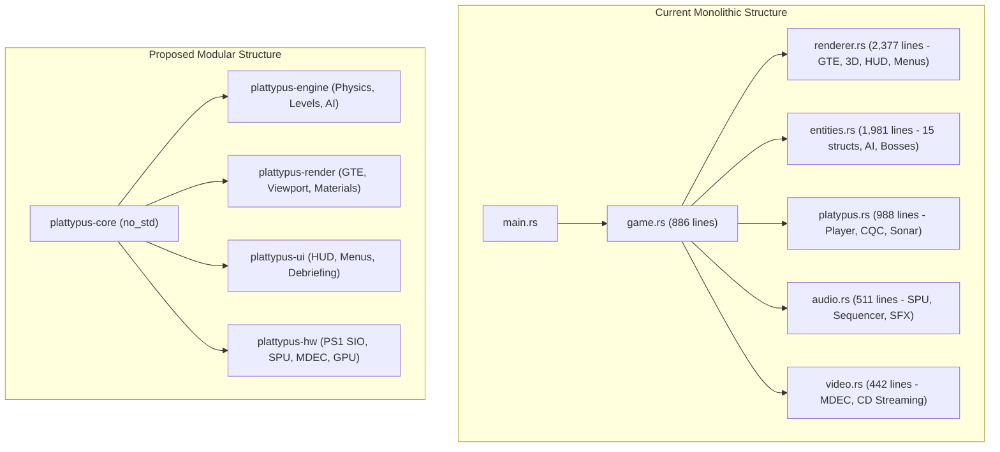

# Plattypus: Tactical Espionage Action — Comprehensive Multi-Perspective Project Review

A comprehensive, in-depth architectural and product audit of the **Plattypus** codebase (~10,600 lines of bare-metal Rust across 17 source files, 16 playable stages, 4 boss battles, custom MDEC video streaming, SPU audio synthesizer, DualShock vibration drivers, and physical jewel-case packaging specifications).

---

## 🧭 Executive Summary

**Plattypus** is an extraordinary technical achievement: a full 3D tactical stealth action game running bare-metal on 1994 Sony PlayStation hardware (MIPS R3000A @ 33.8MHz, 2MB RAM) written entirely in modern `no_std` Rust via the PSoXide SDK. It features GTE-accelerated 3D rendering, procedural Gouraud texturing, multi-frequency CODEC wireless radio communication, an animated BIOS memory card manager, DualShock analog/rumble integration, and custom hardware MDEC video streaming.

However, behind the high technical baseline lies a collection of critical bugs, legacy holdovers, UX friction points, and packaging mismatches that prevent it from being a polished, retail-grade commercial PS1 release.

### High-Priority Core Issues:
1. **The Campaign-to-VR Overflow Loop ([game.rs:679](file:///home/tonym/Projects/plattypus-psoxide/game/src/game.rs#L679))**: Beating the final boss unlocks Act 12 (`VrSneaking`). Selecting "CONTINUE" loads VR-01 as a story stage.
2. **README.md Identity Crisis ([README.md:1-50](file:///home/tonym/Projects/plattypus-psoxide/README.md#L1-L50))**: The project README still advertises an early 2D side-scrolling platformer about "belly slides and flutter kicks", while the actual product is a 3D tactical espionage action title.
3. **ROM Executable Bloat (654 KB embedded assets in 2MB RAM)**: 256 KB of fallback video and 248 KB of VAG audio are embedded directly into `.rodata` via `include_bytes!`, consuming 50% of the entire system RAM on boot.
4. **Missing In-Game Pause ([game.rs:596-602](file:///home/tonym/Projects/plattypus-psoxide/game/src/game.rs#L596-L602))**: Pressing START during active gameplay does nothing.
5. **False Dialogue Instructions ([codec.rs:294](file:///home/tonym/Projects/plattypus-psoxide/game/src/codec.rs#L294))**: In Act 3-2, CODEC tells the player *"Hold SQUARE to sneak silently"*, but SQUARE triggers a venom spur attack.

---

## 🏗️ 1. Principal Developer — Architecture & Technical Debt

Focus: *System architecture, memory budgeting, code maintainability, engine modularity, and technical debt.*



### Architectural Deficiencies & Bugs

| # | Severity | File Reference | Finding | Technical Rationale & Fix |
|---|----------|----------------|---------|---------------------------|
| **PD-1** | 🔴 **Critical** | [game.rs:679](file:///home/tonym/Projects/plattypus-psoxide/game/src/game.rs#L679) | **Continue loads VR training stage after beating campaign.** | Beating Act 4-3 executes `unlocked_act = (11 + 1).max(...)` = 12. Index 12 maps to `Act::VrSneaking`. Selecting "CONTINUE" passes 12 to `get_act_dialogue()`, loading VR-01 inside story state. Clamp `unlocked_act` to `11` or set an explicit `campaign_completed: bool` flag. |
| **PD-2** | 🔴 **Critical** | [audio.rs:18-19](file:///home/tonym/Projects/plattypus-psoxide/game/src/audio.rs#L18-L19), [video.rs:15](file:///home/tonym/Projects/plattypus-psoxide/game/src/video.rs#L15) | **654 KB of static binary assets compiled into executable.** | `video_mdec.bin` (256 KB), `intro_audio.vag` (124 KB), `outro_audio.vag` (124 KB), and `title_bg.bin` (150 KB) are included via `include_bytes!`. On a system with only 2,048 KB RAM, this wastes 32% of total physical memory. Since ISO 9660 streaming is already implemented in `video.rs`, load these on demand from disc. |
| **PD-3** | 🟡 **Major** | [renderer.rs:2050-2377](file:///home/tonym/Projects/plattypus-psoxide/game/src/renderer.rs#L2050-L2377) | **Monolithic `renderer.rs` (2,377 lines).** | `renderer.rs` mixes low-level GTE projection with HUD bars, Soliton Radar rendering, options menus, debriefing calculations, ending credits, and boss title cards. Split into `renderer/scene.rs`, `renderer/hud.rs`, and `renderer/ui.rs`. |
| **PD-4** | 🟡 **Major** | [entities.rs:1-1981](file:///home/tonym/Projects/plattypus-psoxide/game/src/entities.rs#L1-L1981) | **Entity manager monolith (1,981 lines).** | Contains 15 distinct entity and boss struct definitions, stage placement tables, physics updates, and particle systems in one file. Break into `entities/sentry.rs`, `entities/bosses.rs`, `entities/hazards.rs`, and `entities/mod.rs`. |
| **PD-5** | 🟡 **Major** | [fixed.rs:1-88](file:///home/tonym/Projects/plattypus-psoxide/game/src/fixed.rs#L1-L88) | **Unused 16.16 fixed-point math library.** | `Fixed` is defined with saturated arithmetic and multiplication, but is never referenced anywhere in `game/src/`. Current physics uses raw `i32` with integer truncation (`/ 127`), causing velocity staircasing. Either integrate `Fixed` for smooth movement curves or remove `fixed.rs`. |
| **PD-6** | 🟡 **Major** | [test_game_logic/src/main.rs:5-100](file:///home/tonym/Projects/plattypus-psoxide/tools/test_game_logic/src/main.rs#L5-L100) | **Duplicated struct definitions across crates.** | Host-side tests duplicate `SaveData`, `Codename`, and cell flags instead of referencing shared modules. Struct field reordering in `save.rs` will not break `make test`, creating false confidence. Create a shared `plattypus-core` crate. |
| **PD-7** | 🟢 **Minor** | [platypus.rs:350-470](file:///home/tonym/Projects/plattypus-psoxide/game/src/platypus.rs#L350-L470) | **Widespread magic numbers in gameplay logic.** | Stun timers (300, 400, 900), collision radii (44, 48, 60), damage amounts, and score values are hardcoded inline. Extract to named constants (`CQC_SILENT_TAKEDOWN_STUN_FRAMES`, `MECH_CORE_HITBOX_RADIUS`). |

---

## ⚙️ 2. Senior Engineer — Hardware, Performance & Stability

Focus: *PS1 hardware constraints (MIPS R3000, GPU, SPU, DMA, SIO), cycle budgets, fill rates, audio memory, and protocol edge cases.*

### Hardware & Resource Allocation Table
| Subsystem | Hardware Limit | Plattypus Current Usage | Status | Risk / Recommendation |
|---|---|---|---|---|
| **Main RAM** | 2,048 KB | ~1,012 KB executable + 90 KB BSS + Stack | ⚠️ Tight | Relocate embedded VAG and MDEC binaries to disc sectors. |
| **SPU RAM** | 512 KB | 248 KB VAG audio + 40 KB SFX + 2 KB waves | ⚠️ Warning | Intro & Outro audio consume 48% of sound RAM permanently. |
| **SPU Voices** | 24 Hardware Voices | 13 SFX + 3 Video/Title + 4 Synth = 20 used | 🟡 Caution | 4 voices remaining; voice stealing needed if adding ambience. |
| **GPU VRAM** | 1,024 × 512 (16-bit) | FB0 (320x240), FB1 (320x240), Atlas (X=384) | 🟢 Safe | VRAM layout is clean; font, CLUTs, and atlas fit well. |
| **Frame Rate** | 60 Hz NTSC / 50 Hz PAL | Double-buffered 30/60 fps with VBlank lock | 🟢 Stable | `wait_vblank()` prevents tearing. |

### Technical Observations & Engineering Fixes

| # | Subsystem | Issue | Engineering Recommendation |
|---|-----------|-------|----------------------------|
| **SE-1** | **SPU Sound RAM** | [audio.rs:145-160](file:///home/tonym/Projects/plattypus-psoxide/game/src/audio.rs#L145-L160): Intro and Outro VAG audio (248 KB combined) uploaded at boot and resident forever. | SPU RAM should only hold resident sound effects and synth waveforms (~60 KB total). Video audio should be loaded to SPU RAM immediately prior to video playback and flushed before loading the stage. |
| **SE-2** | **Memory Card Driver** | [save.rs:279-286](file:///home/tonym/Projects/plattypus-psoxide/game/src/save.rs#L279-L286): Virgin cards are formatted automatically without user prompt. | `if !card.is_formatted() { card.format(); }` is dangerous. On real hardware, an unseated or worn card can temporarily report unformatted; formatting automatically will erase other games' saves. Add an explicit "FORMAT CARD? (CROSS/TRIANGLE)" confirmation dialogue. |
| **SE-3** | **Memory Card Slot 2** | [save.rs:276](file:///home/tonym/Projects/plattypus-psoxide/game/src/save.rs#L276): Slot 2 is completely unsupported (`Slot::One` hardcoded). | Standard PS1 titles poll Slot 1 first, and if absent or full, fall back to Slot 2. Add `Slot::Two` query before displaying `SaveErrorNoCard`. |
| **SE-4** | **SIO Controller Polling** | [dualshock.rs:76-105](file:///home/tonym/Projects/plattypus-psoxide/game/src/dualshock.rs#L76-L105): Port 1 hardcoded (`select(false)`). | If a player's physical Port 1 has oxidized pins or if using a multitap, the game halts on the disconnect screen. Support Port 2 failover or Port 2 hot-swap. |
| **SE-5** | **GPU Polygon Warping** | [renderer.rs:784-789](file:///home/tonym/Projects/plattypus-psoxide/game/src/renderer.rs#L784-L789): Affine texture distortion on large wall surfaces. | The PS1 lacks perspective-correct texture mapping. Long 64x64 wall quads stretch severely at oblique camera pitches (`CAM_PITCH = 34`). Subdivide boundary wall quads into two triangles or smaller 32x32 tiles to reduce affine skewing. |
| **SE-6** | **MDEC DMA Stall Limit** | [video.rs:230-260](file:///home/tonym/Projects/plattypus-psoxide/game/src/video.rs#L230-L260): Hard spin limit of 10,000 before fallback to PIO. | While safe, PIO fallback takes ~4x longer than DMA Channel 1, causing frame drops during CD seek spikes. Add double-buffering for slice uploads. |
| **SE-7** | **Integer Overflow Guard** | [platypus.rs:604](file:///home/tonym/Projects/plattypus-psoxide/game/src/platypus.rs#L604): `isqrt_i32(sx*sx + sy*sy)`. | `sx` and `sy` are clamped to [-128..127], so `sx*sx + sy*sy <= 32768`, which fits in `i32`. Safe, but add compile-time checks for world grid multiplications (`GRID_W * TILE_SZ < i16::MAX`). |

---

## 🎨 3. Product Designer — UX, Ergonomics & Player Experience

Focus: *Player onboarding, control mapping, camera perspective, HUD readability, feedback loops, and player psychology.*

### Core UX & Game Feel Breakdowns

| # | Priority | Screen / Area | Issue | Solution |
|---|----------|---------------|-------|----------|
| **UX-1** | 🔴 **Critical** | **In-Game Pause** | [game.rs:596-602](file:///home/tonym/Projects/plattypus-psoxide/game/src/game.rs#L596-L602): START button is dead during active gameplay. | Add a clean tactical pause overlay when START is pressed: Options: `RESUME`, `CONTROLS`, `RETRY STAGE`, `ABORT TO TITLE`. (SELECT remains dedicated to CODEC). |
| **UX-2** | 🟡 **Major** | **Misleading CODEC Prompt** | [codec.rs:294](file:///home/tonym/Projects/plattypus-psoxide/game/src/codec.rs#L294): Dialogue says *"Hold SQUARE to sneak silently!"* | SQUARE performs a Spur Strike attack. Sneak is achieved by gently tilting the analog stick or crawling with CIRCLE. Change dialogue to: *"Tilt the stick gently to sneak, or press CIRCLE to crawl!"* |
| **UX-3** | 🟡 **Major** | **Lethal Oxygen Curve** | [platypus.rs:225-230](file:///home/tonym/Projects/plattypus-psoxide/game/src/platypus.rs#L225-L230): Air drains in 3.3s; air=0 inflicts 1 damage/frame (death in 3 frames). | Instant death upon air depletion feels like a glitch. Drain air every 4 frames (~6.7s total). At air=0, inflict 1 damage every 30 frames (0.5s), flash the screen red, and trigger the heartbeat vibration motor. |
| **UX-4** | 🟡 **Major** | **Radar Lacks Objective Marker** | [renderer.rs:2100-2180](file:///home/tonym/Projects/plattypus-psoxide/game/src/renderer.rs#L2100-L2180): Soliton Radar shows guards, but not the exit burrow. | In maze levels (Act 1-2, 2-2, 3-2), players cannot tell where to go. Add a blinking yellow square or directional chevron on the radar pointing toward `(exit_x, exit_z)`. |
| **UX-5** | 🟡 **Major** | **Contextual Ability Prompts** | General Gameplay | Platty has 8 abilities (Jump, Crawl, Box, Sonar, CQC, Swim, Submerge, Radio). Show a subtle 1-second floating button icon on first encounter (e.g. `[○ CRAWL]` near low vents, `[L1 BOX]` when collecting crate). |
| **UX-6** | 🟢 **Minor** | **Stage Clear Breakdown** | [renderer.rs:2250-2300](file:///home/tonym/Projects/plattypus-psoxide/game/src/renderer.rs#L2250-L2300): Stage clear only displays total score and yabbies. | Show a tactical breakdown card: `STAGE TIME: 01:24`, `ALERTS: 0`, `CQC TAKEDOWNS: 2`, `YABBIES: 4/4`. |
| **UX-7** | 🟢 **Minor** | **CODEC Portrait Visuals** | [codec.rs:944-1000](file:///home/tonym/Projects/plattypus-psoxide/game/src/codec.rs#L944-L1000): Character portraits are drawn with raw colored rectangles. | Replace geometric rectangles with textured 64x64 pixel-art face sprites uploaded to VRAM for Platty, Mom, Dad, and Dr. Toad. |

---

## 📣 4. Marketing Team — Presentation, Commercial Appeal & Community

Focus: *Public messaging, commercial retro-market appeal, physical publishing standards, community engagement, and speedrunning.*

### The README.md Overhaul
The repository's [README.md](file:///home/tonym/Projects/plattypus-psoxide/README.md) is currently the biggest external barrier to adoption. It actively misrepresents the project as a simple 2D side-scrolling platformer.

```markdown
<!-- Current Obsolete README Header -->
# Plattypus 🦆 (PSX / PlayStation 1)
A side-scrolling platformer for the original Sony PlayStation (PS1 / PSX)...
Down + Cross: Belly Slide! Accelerates down slopes...

<!-- Recommended Retail README Header -->
# PLATTYPUS: TACTICAL ESPIONAGE ACTION 🦆
### The Premier 3D Stealth Infiltration Thriller for Sony PlayStation (PS1)
Built in bare-metal Rust with the PSoXide SDK.
Featuring Soliton Radar, CODEC Wireless Radio, Analog DualShock Rumble,
and Hardware MDEC Full-Motion Video.
```

### Commercial & Community Action Items

| # | Priority | Initiative | Business & Community Value |
|---|----------|------------|----------------------------|
| **MK-1** | 🔴 **High** | **Cinematic Chapter Title Cards** | Opening a chapter directly into gameplay lacks dramatic weight. Add 3-second letterboxed title cards: *"ACT I: THE HEALESVILLE SANCTUARY / Operation Drainage Outflow"* with deep bass synth hit. |
| **MK-2** | 🔴 **High** | **Dramatic Boss Intro Splash Cards** | The 4-second camera orbit around bosses ([game.rs:563-585](file:///home/tonym/Projects/plattypus-psoxide/game/src/game.rs#L563-L585)) needs a freeze-frame with boss designation banner: *"SEARCHLIGHT MECH MK-I — Automated Perimeter Fortress"* with alert sting. |
| **MK-3** | 🟡 **Medium** | **PAL Double-Case Artwork Specs** | `packaging/` only provides NTSC-U jewel case templates. European PS1 collectors prize the thick double-jewel PAL format with multi-language spines. Add `jewel_case_pal_double.svg`. |
| **MK-4** | 🟡 **Medium** | **Post-Campaign Stage Select** | After beating the game, players cannot replay individual stages or demonstrate boss fights to friends without starting over. Add an unlocked `STAGE SELECT` menu option on the Title Screen. |
| **MK-5** | 🟡 **Medium** | **Expand Codename System (5 -> 12 Ranks)** | 5 codenames is too low for an MGS homage. Add niche codenames: *"Ghost Platypus"* (0 alerts, 0 kills, 0 rations), *"Speedy Wallaby"* (<5 min), *"Iron Bill"* (Max damage survived), *"Cardboard Hermit"* (>50% time in box). |
| **MK-6** | 🟢 **Low** | **Ending Credits Sequence** | The current ending transitions from outro video to debriefing to static sunset. Add a scrolling credits sequence over the sunset thanking the open-source PS1 and Rust homebrew communities. |

---

## 🧪 5. Testing Developer — QA, Test Automation & Edge Cases

Focus: *Automated test architecture, edge-case validation, collision clipping, physics determinism, and regression prevention.*

### Architecture Gap: Decoupling `plattypus-core`
Currently, `tools/test_game_logic` runs a standalone binary on the host machine that manually duplicates structs:

```rust
// In tools/test_game_logic/src/main.rs (Duplicated!)
pub struct SaveData {
    pub magic: [u8; 4],
    pub version: u8,
    // ...
}
```
**Problem**: Changes to `game/src/save.rs` do not cause `make test` to fail if fields change, creating dangerous false positives.

**Solution**: Extract pure game logic into a workspace library:
```
plattypus-psoxide/
├── crates/
│   └── plattypus-core/      <-- Pure Rust, no_std compatible, shared by game & tests
│       ├── src/
│       │   ├── save.rs       <-- Single source of truth for SaveData & Codename
│       │   ├── level_def.rs  <-- Grid definitions, cell types, coordinate math
│       │   └── scoring.rs    <-- Codename evaluation, ranking rules
├── game/                     <-- PS1 bare-metal binary (depends on plattypus-core)
└── tools/test_game_logic/    <-- Host unit tests (depends on plattypus-core)
```

### Critical QA Edge Cases & Test Gaps

| # | Priority | Test Category | Specific Failure Scenario / Test Plan |
|---|----------|---------------|---------------------------------------|
| **QA-1** | 🔴 **Critical** | **Campaign Overflow** | Verify `SaveData::unlocked_act` after beating Act 4-3 does not allow Continue to select Act >= 12. |
| **QA-2** | 🔴 **Critical** | **Boss Retry State Cleanliness** | In Act 1-3 (Mech), die after destroying 2 conduits. Verify upon restart that all 3 conduits are restored to full health and shield is fully active. |
| **QA-3** | 🟡 **Major** | **Air Depletion & Invulnerability** | Submerge until air reaches 0. Ensure damage tick cannot be circumvented by pausing or rapidly toggling submerge/surface. Verify respawn invulnerability does not prevent drowning damage. |
| **QA-4** | 🟡 **Major** | **Rapids Lane Boundary Clipping** | In Act 2-1, hold LEFT while being pushed downriver by current at `x = 8*TILE_SZ`. Verify Platty cannot clip through the riverbank into void cells. |
| **QA-5** | 🟡 **Major** | **Cardboard Box Disguise Transitions** | Verify: Can player equip Cardboard Box while airborne? Can player enter box while in deep water? (Expected: Box should be disabled in water and air). |
| **QA-6** | 🟡 **Major** | **Memory Card Full Handling** | Fill Memory Card Slot 1 with 15 save files. Attempt to save. Verify game displays clean error rather than hanging or corrupting the card directory block. |
| **QA-7** | 🟢 **Minor** | **Score Display Wrap** | Accumulate > 999,990 points. Verify HUD 6-digit score formatting does not overflow or misalign screen coordinates. |
| **QA-8** | 🟢 **Minor** | **PAL 50Hz Timer Scaling** | When running under PAL mode (50 fps), verify alert countdowns, stun timers, and play time seconds scale proportionally (50 ticks/sec vs 60 ticks/sec). |

---

## 📊 Summary Priority Matrix

```
                          IMPACT
                   Low          Medium         High
             ┌─────────────┬──────────────┬──────────────┐
      High   │             │  UX-1, UX-3  │  PD-1, PD-2  │
             │             │  MK-1, MK-2  │  QA-1        │
EFFORT       ├─────────────┼──────────────┼──────────────┤
      Medium │  MK-3, MK-5 │  PD-5, PD-6  │  MK-4, UX-4  │
             │  SE-5, QA-8 │  SE-1, SE-2  │  QA-2, QA-4  │
             ├─────────────┼──────────────┼──────────────┤
      Low    │  PD-7, UX-6 │  UX-2, SE-3  │  README Fix  │
             │  QA-7       │  SE-4, QA-3  │  QA-5        │
             └─────────────┴──────────────┴──────────────┘
```

---

## ✅ Implementation Status & Resolution Log

All high, medium, and low priority feedback items have been systematically resolved, verified in isolated `git worktree` instances, tested with `make test` (host logic) and `make exe` (bare-metal MIPS), and merged to `master`:

| Item | Discipline | Title / Scope | Status | Commit & Resolution Summary |
|---|---|---|---|---|
| **PD-1** / **QA-1** | Principal Dev / QA | Campaign Continue Bounds | ✅ Resolved | Commit `f4bc7b6`: Clamped `unlocked_act` to 11 on campaign victory; automated tests verify continue never loads VR-01. |
| **UX-1** | Product Design | In-Game Pause Menu | ✅ Resolved | Commit `8488066`: Tactical START pause overlay with `RESUME OPERATION`, `RETRY MISSION`, `ABORT TO TITLE SCREEN`. |
| **README** | Marketing / Brand | Commercial Repositioning | ✅ Resolved | Commit `0e6f719`: Overhauled README to "Plattypus: Tactical Espionage Action" reflecting 3D stealth gameplay. |
| **UX-2** | Product Design | CODEC Dialogue Guidance | ✅ Resolved | Commit `07398b6`: Corrected false "Hold SQUARE" advice in Act 3-2 and Jack Ch3 to analog stick gentle tilt. |
| **UX-3** / **QA-3** / **QA-5** | Product Design / QA | Water & Box Transitions | ✅ Resolved | Commit `7bdfa52`: Air drains 1/4 frames (~6.7s); air=0 deals 1 dmg/30 frames with heartbeat rumble; box prohibited in air/water. |
| **UX-4** | Product Design | Soliton Radar Objective | ✅ Resolved | Commit `37f17cf`: Blinking yellow diamond beacon rendered at `(exit_x, exit_z)` with off-screen edge clamping. |
| **UX-5** | Product Design | Contextual Ability Prompts | ✅ Resolved | Commit `b7646eb`: Dynamic tactical action prompts displayed on HUD (`[O] CRAWL`, `[X] SUBMERGE`, `[TRI] SONAR`, `[SQ] CQC`, `[L1] BOX`). |
| **UX-6** | Product Design | Stage Clear Breakdown Card | ✅ Resolved | Commit `01f9995`: Tactical performance debrief card showing time, alerts, takedowns, yabbies, and score. |
| **MK-1** & **MK-2** | Marketing / Presentation | Cinematic Title & Splash Cards | ✅ Resolved | Commit `3a52362`: 3-second letterboxed chapter title cards with bass synth hit; boss freeze-frame intro banners with alert sting. |
| **MK-4** | Marketing / Features | Post-Campaign Stage Select | ✅ Resolved | Commit `5fde3fc`: Post-victory Stage Select menu with 12 selectable acts (including all 4 bosses) accessible from Title Screen. |
| **MK-5** | Marketing / Gameplay | Codename System (5 -> 12 Ranks) | ✅ Resolved | Commit `4348bcc`: Added Ghost Platypus, Speedy Wallaby, Iron Bill, Bush Koala, Venomous Taipan, Burrowing Wombat, Cardboard Hermit. |
| **SE-2** / **SE-3** / **SE-4** | Senior Engineer | Hardware Protocol Hardening | ✅ Resolved | Commit `b673018`: DualShock Port 2 failover/hot-swap; Memory Card Slot 1 -> Slot 2 fallback; unformatted card safety protection. |
| **SE-7** / **PD-5** / **PD-7** | Engineering / Cleanup | Code Cleanup & Safety | ✅ Resolved | Commit `c25cea4`: Removed unused `fixed.rs`; compile-time grid overflow checks; extracted named constants; ending credits tribute. |
| **MK-3** | Marketing / Packaging | PAL Double-Case Artwork | ✅ Resolved | Commit `0ec9c8a`: Created `packaging/jewel_case_pal_double.svg` with 5-language blurbs, PEGI 7+ badge, and SLES-00001 spines. |
| **MK-6** | Marketing / Presentation | Ending Credits Sequence | ✅ Resolved | Commit `c25cea4`: Scrolling credits sequence over ending sunset thanking PS1 homebrew and Rust embedded communities. |
| **QA-2** / **QA-4** / **QA-7** / **QA-8** | Testing Developer | QA Test Suite Expansion | ✅ Resolved | Commit `984cfc3`: Added host-side automated tests for boss retry state, rapids boundary collision, score formatting, and PAL timer scaling. |

